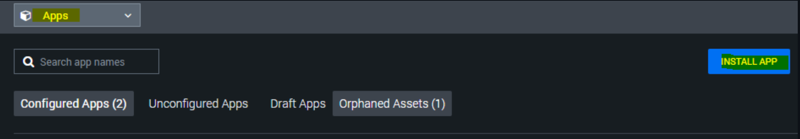
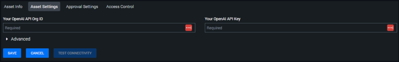
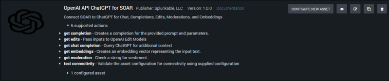

# Splunk> Phantom

Welcome to the open-source repository for Splunk> Phantom's openaiapichatgpt App.

Please have a look at our [Contributing Guide](https://github.com/Splunk-SOAR-Apps/.github/blob/main/.github/CONTRIBUTING.md) if you are interested in contributing, raising issues, or learning more about open-source Phantom apps.

## Legal and License

This Phantom App is licensed under the Apache 2.0 license. Please see our [Contributing Guide](https://github.com/Splunk-SOAR-Apps/.github/blob/main/.github/CONTRIBUTING.md#legal-notice) for further details.

# OpenAI-API-ChatGPT-for-SOAR Installation Instructions

1. Install app using latest .tgz via SOAR UI:  

2. Configure the asset  

3. Actions:  

